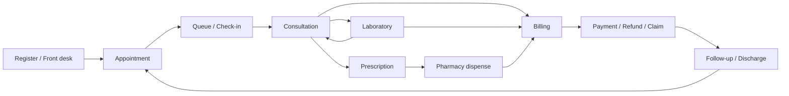
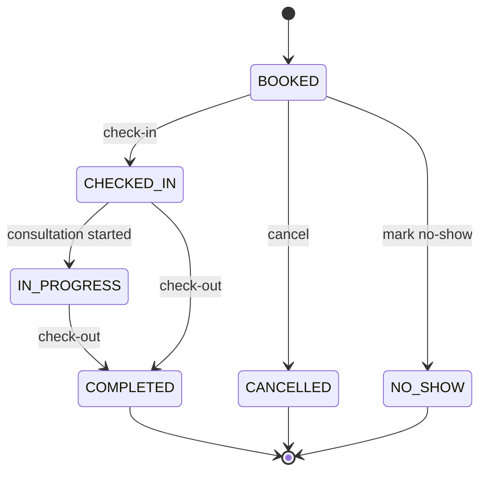
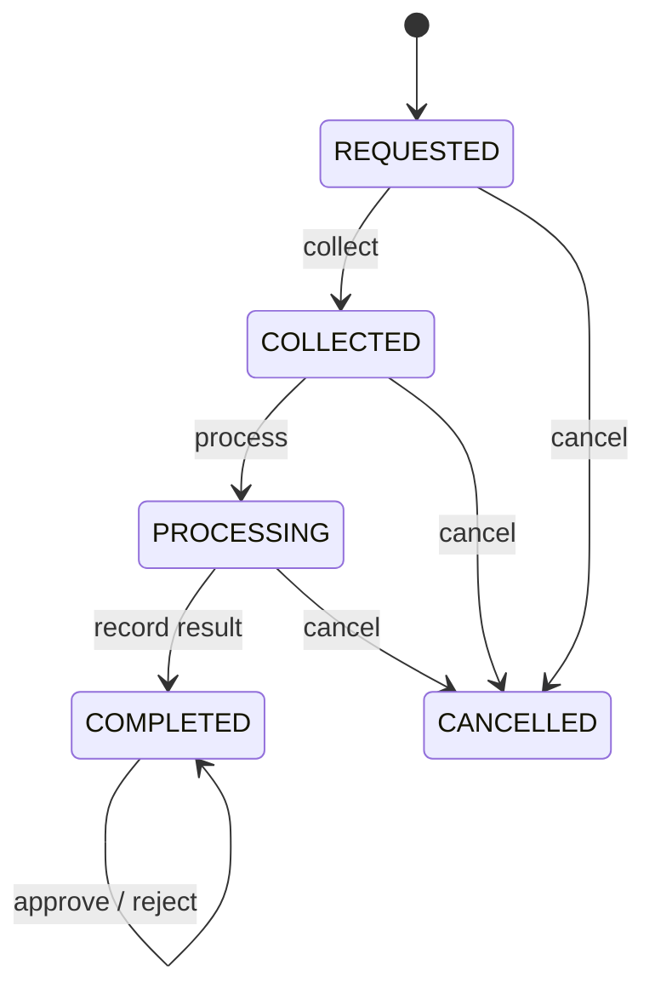
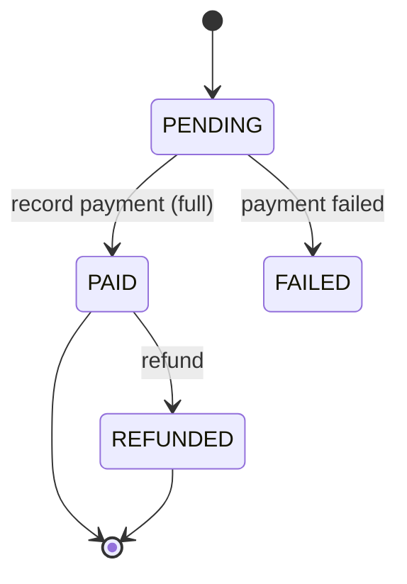
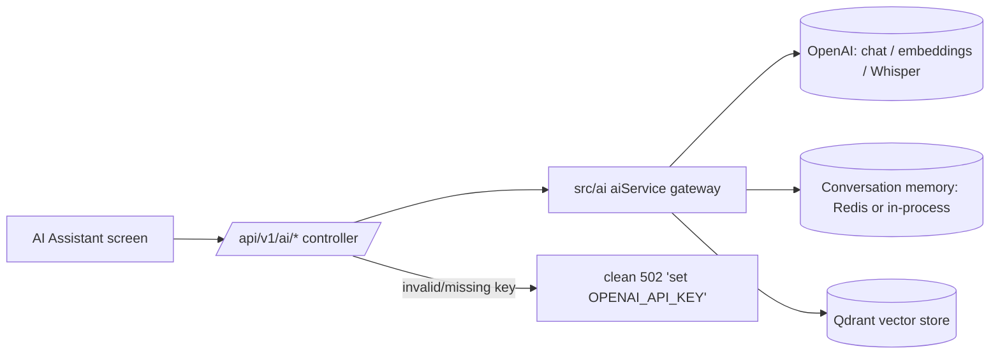
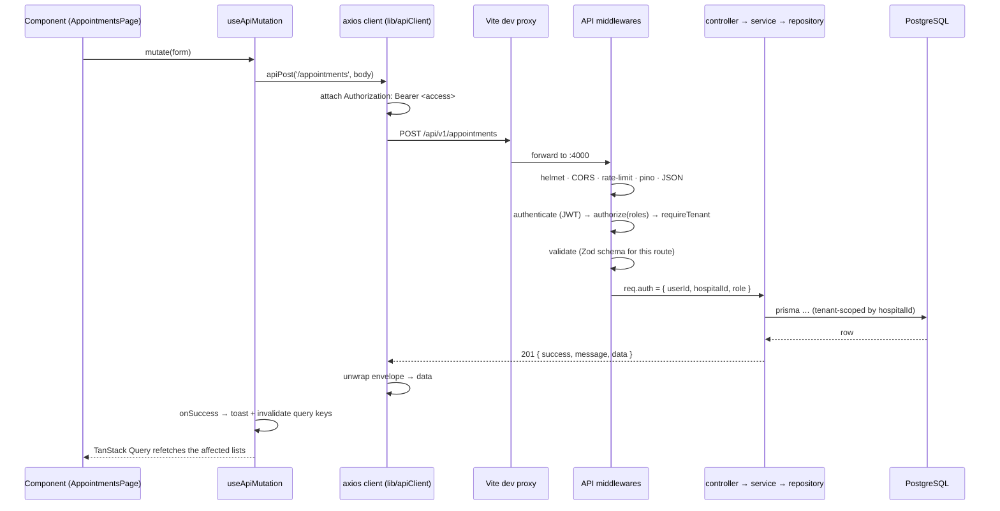

# Renovia Hospital OS — Web App Workflow

How the application works end to end: the clinical journey a patient takes through the
system, the screens and roles involved at each step, the API calls behind them, and the
supporting administrative and AI workflows.

- **Frontend:** `http://localhost:5173` (React SPA)
- **API:** `http://localhost:4000/api/v1` (proxied from the SPA as `/api`)
- **Login for the seeded demo tenant:** `admin@renovia.demo` / `Passw0rd!23`

---

## 1. The big picture



Every box above is a screen in the app. The **AI Assistant** sits alongside the whole
flow (discharge summaries, prescription drafts, lab interpretation, patient explainers,
etc.) and is described in [§6](#6-ai-assistant-workflow).

---

## 2. Roles

RBAC is enforced by the API (`authenticate → authorize(roles) → requireTenant`) and
mirrored in the UI — the sidebar only shows sections a role may use. `HOSPITAL_ADMIN`
sees everything.

| Role | Primary responsibilities in the app |
|---|---|
| `HOSPITAL_ADMIN` | Everything: tenant setup, users, doctors, departments, reports, audit, all clinical & ops screens |
| `RECEPTIONIST` | Register patients, book appointments, run the queue, take payments |
| `DOCTOR` | Consultations, prescriptions, order labs, discharge summaries, AI doctor tools |
| `NURSE` | Vitals, queue, assist with consultations & labs |
| `LABORATORY_TECHNICIAN` | Sample collection → processing → result entry |
| `PHARMACIST` | Formulary, stock/batches, dispense against prescriptions |
| `ACCOUNTANT` | Invoices, payments, refunds, insurance claims, financial reports |
| `PATIENT` | (API role) self-service booking & record access |
| `SUPER_ADMIN` | Cross-tenant/system operations (not a normal tenant user) |

---

## 3. Session & authentication

```mermaid
sequenceDiagram
    participant U as User
    participant SPA as React SPA
    participant API as Express API
    U->>SPA: email + password
    SPA->>API: POST /auth/login
    API-->>SPA: { accessToken, refreshToken, user }
    Note over SPA: tokens in memory + localStorage;<br/>role decoded from JWT
    SPA->>API: GET /auth/profile  (Bearer accessToken)
    API-->>SPA: profile → status "authenticated"
    loop every API call
        SPA->>API: request + Authorization: Bearer <access>
    end
    API-->>SPA: 401 (access expired)
    SPA->>API: POST /auth/refresh  (single-flight; concurrent 401s share it)
    API-->>SPA: new { accessToken, refreshToken }  → original request replayed
    Note over SPA,API: refresh-token reuse is rejected (theft detection) → forced logout
```

- **New tenant:** `POST /auth/register` from the sign-in screen creates the hospital +
  its first `HOSPITAL_ADMIN`, then the SPA logs in automatically.
- **New staff:** `HOSPITAL_ADMIN` adds them under **Users & Roles**
  (`POST /auth/users` with a role), then can change roles later
  (`PATCH /auth/users/:id/role`).
- Logout (`POST /auth/logout` / `logout-all`) revokes the session server-side; the SPA
  clears its cache.

---

## 4. The core clinical journey

Each step lists: **who**, **screen**, **what happens**, **key API calls**, **result**.

### 4.1 Register the patient

- **Who:** Receptionist / Admin / Nurse
- **Screen:** `Patients` → “Register patient”
- **What:** capture MRN, name, DOB, contact. On the patient record you can then add
  **allergies**, **chronic diseases**, **insurance**, **emergency contacts**,
  **vitals**, and **clinical notes**; the **Timeline** and **Clinical history** tabs
  aggregate everything.
- **API:** `POST /patients` → `POST /patients/:id/allergies|vitals|insurance|…`
- **Result:** an `ACTIVE` patient, ready to be booked. Sub-records feed the EHR and are
  visible to clinicians during the consultation.

### 4.2 Book the appointment

- **Who:** Receptionist / Admin / Doctor
- **Screen:** `Appointments` → “Book appointment” (needs a **Doctor profile** to exist —
  see [§5.1](#51-tenant-setup))
- **What:** choose patient, doctor, (optional) department, date/time, duration, reason.
  Walk-ins and recurring series are also supported by the API.
- **API:** `POST /appointments` (`scheduledAt` ISO, `durationMinutes`)
- **Result:** appointment in status **`BOOKED`**. It appears on the `Appointments` list
  and in the `Live Queue` for its day.

### 4.3 Arrival — the live queue

- **Who:** Receptionist / Nurse
- **Screen:** `Live Queue` (auto-refreshes every 15 s), lanes **Waiting → Checked in →
  In consultation → Completed**
- **What:** **Check in** the patient on arrival; **Check out** when the visit ends.
  Cancellations and no-shows are set from the `Appointments` list.
- **API:** `POST /appointments/:id/check-in` · `…/check-out` · `…/cancel` ·
  `PATCH /appointments/:id/status`
- **Appointment state machine:**



### 4.4 The consultation

- **Who:** Doctor (Admin)
- **Screen:** `Consultations` → “New consultation” (or from the patient record)
- **What:** record **clinical notes**, **diagnosis**, **treatment plan**, and an optional
  **follow-up** date. Link it to the appointment.
- **API:** `POST /consultations` → `PATCH /consultations/:id` to amend
- **Result:** the encounter is now part of the patient’s **Clinical history** and
  **Timeline**. From here the doctor can order labs and issue prescriptions.
- **AI here:** *Prescription draft* and *Lab interpretation* tools (see §6) help compose
  the next two steps.

### 4.5 Laboratory (optional branch)

- **Who:** Doctor/Nurse order → Lab technician processes → Doctor approves
- **Screen:** `Laboratory`
- **Flow:** order a test → **collect** sample → **process** → **record result** →
  **approve** (or **reject** / **cancel**). A printable report is available once complete.
- **API:** `POST /lab-tests` → `…/collect` → `…/process` → `…/result` → `…/approve` ·
  `GET /lab-tests/:id/report`
- **Lab state machine:**



- **AI here:** *Lab interpretation* (structured read of the values) and *Lab report
  analysis* (abnormal-value flags, trends vs. history).

### 4.6 Prescription

- **Who:** Doctor (Admin)
- **Screen:** `Prescriptions` → “New prescription” (link to the consultation)
- **What:** medicine name, dosage, frequency, duration, instructions.
- **API:** `POST /prescriptions`
- **Result:** a prescription attached to the patient (and consultation), ready for the
  pharmacy to dispense.

### 4.7 Pharmacy dispense

- **Who:** Pharmacist (Admin)
- **Screen:** `Pharmacy`
- **Prerequisite:** the medicine must exist in the **formulary** with stock
  (add via “Add medicine”; the dispense step matches on medicine **name**).
- **What:** “Dispense” → pick the patient’s prescription → stock is deducted and a
  dispense record is written.
- **API:** `POST /medicines` (formulary) · `POST /medicines/batches/:medicineId` (stock) ·
  `POST /medicines/dispense/:prescriptionId`
- **Result:** `remainingStock` decreases; the dispense appears in dispensing history.
  Low-stock rows are flagged red on the formulary.
- **AI here:** *Pharmacy assistant* — interaction checks, dosage review, inventory
  forecast.

### 4.8 Billing

- **Who:** Accountant / Admin
- **Screen:** `Billing` → “Create invoice”, then the invoice detail page
- **What:** build line items (consultation fee, lab charges, medicines…), apply a
  discount, then on the detail page **Record payment**, **Refund**, or **File insurance
  claim**. A receipt is available for paid invoices.
- **API:** `POST /invoices` · `POST /invoices/:id/pay` · `…/refund` · `…/claims` ·
  `GET /invoices/:id/receipt`
- **Invoice state machine:**



- **AI here:** *Billing assistant* — explain an invoice, detect duplicates, help with a
  claim, draft a payment reminder.

### 4.9 Follow-up & discharge

- **Who:** Doctor / Nurse
- **Screen:** patient record → discharge summary; `Appointments` for the follow-up
- **What:** create a **discharge summary** (diagnosis, summary, medications, follow-up
  instructions) and book the follow-up appointment — which loops back to §4.2.
- **API:** `POST /patients/:id/discharge-summary` · `GET …/discharge-summary` ·
  `GET /patients/:id/timeline`
- **AI here:** *Discharge summary* generates a structured draft from the encounter
  details; *Patient explainer* rewrites it in plain language.

---

## 5. Supporting & administrative workflows

### 5.1 Tenant setup

Done once by `HOSPITAL_ADMIN` before the clinical flow can run:

1. **Departments** — `POST /departments`.
2. **Users & Roles** — create `DOCTOR`, `RECEPTIONIST`, `NURSE`, `PHARMACIST`,
   `LABORATORY_TECHNICIAN`, `ACCOUNTANT` accounts (`POST /auth/users`).
3. **Doctors** — attach a **Doctor profile** (specialization, license, fee) to a `DOCTOR`
   user (`POST /doctors`); set weekly **availability** (`PUT /doctors/:id/availability`).
4. **Hospital / branches / working hours** — `PATCH /hospitals/me`, `POST /hospitals/branches`.

Appointments cannot be booked until at least one Doctor profile exists.

### 5.2 Staff / HR

- **Screen:** `Staff / HR` — employee register (designation, department, join date).
- **API:** `POST /employees`; the API additionally supports attendance
  (`/attendance/check-in|out`), **shifts** (`/shifts`), **leave** requests/approvals,
  and performance notes.

### 5.3 Inventory & procurement

- **Screen:** `Inventory` — equipment & consumables with quantity and reorder level;
  inline `+ / −` adjusts stock. `Suppliers` lists procurement partners.
- **API:** `POST /inventory` · `PATCH /inventory/:id` · `POST /medicines/suppliers` ·
  `POST /medicines/purchase-orders` → `…/receive` (restocks the formulary).

### 5.4 Notifications

- **Screen:** `Notifications` — outbound messages queued through the notification engine;
  **Send notification** picks a recipient, channel (EMAIL / SMS / WHATSAPP / PUSH), and body.
- **Delivery:** EMAIL is delivered when SMTP is configured. SMS / WhatsApp / Push are
  **persisted and queued** but not marked delivered until real provider adapters are
  configured — they run through the worker’s retry / failed-job lifecycle.
- **API:** `POST /notifications` · `POST /notifications/broadcast` · templates under
  `/notification-templates`.

### 5.5 Reports

- **Screen:** `Reports` (tabs) and the `Dashboard` KPIs.
- **API:** `GET /reports/dashboard` (headline KPIs) · `/reports/revenue` ·
  `/appointments` · `/patients` · `/doctors` · `/laboratory` · `/pharmacy` ·
  `/reports/exports` (PDF / Excel).

### 5.6 Audit logs

- **Screen:** `Audit Logs` (Admin only) — every mutating action is recorded with actor,
  entity, timestamp and metadata.
- **API:** `GET /audit-logs` (filters: action, resource, actor, date range).

---

## 6. AI Assistant workflow

**Screen:** `AI Assistant` (sidebar → Overview). **API:** `POST /api/v1/ai/**`.
`GET /api/v1/ai/status` reports provider readiness; the page shows a banner until a real
`OPENAI_API_KEY` is set in the backend `.env` (restart the API after adding it).



| Tool group | Tools & endpoints |
|---|---|
| **Conversational** | Clinical assistant `POST /ai/chat` (multi-turn, keeps a `sessionId`), AI receptionist `POST /ai/receptionist`, Knowledge base `POST /ai/knowledge/ingest` + `…/query` (RAG), Smart search `POST /ai/smart-search`, Voice `POST /ai/transcribe` (base64 audio → Whisper) |
| **Doctor tools** | `POST /ai/discharge-summary`, `…/prescription-draft`, `…/lab-interpretation`, `…/lab-analysis` |
| **Patient** | `POST /ai/patient-explainer` |
| **Operations** | `POST /ai/billing`, `…/pharmacy`, `…/document`, `…/analytics` |

- **Memory:** clinical chat and the receptionist keep conversation context. If
  `REDIS_URL` is reachable it is Redis-backed; otherwise an **in-process** store is used
  (works for a single API process, no external dependency).
- **Knowledge base:** needs **Qdrant** on `QDRANT_URL`. Ingest documents first, then
  queries are answered from those chunks with citations. Without Qdrant the tool returns
  a clear `503`.
- **Errors:** a missing/invalid key never crashes the server — the controller returns a
  normalized `502` with guidance; rate limits map to `429`.

---

## 7. Anatomy of a single request

What happens when a user clicks, e.g., **“Book appointment”**:



Key properties:

- **Same-origin in dev** — the SPA calls `/api/...`; Vite proxies to `:4000`, so there is
  no CORS preflight on the hot path.
- **Envelope** — every response is `{ success, message, data, meta? }`; list endpoints put
  `{ data: [...], meta: { page, limit, total, totalPages } }` inside `data`. The client
  normalizes both to a `Paginated<T>` shape.
- **Errors** — `{ success:false, message, errors:[{field,message}], statusCode }` become a
  typed `ApiError`; forms bind `errors[]` inline, mutations show a toast.
- **Auth refresh** — a `401` triggers one shared `/auth/refresh`; queued requests replay
  once; a failed refresh forces logout across tabs.
- **Cache** — writes declare which query keys to invalidate, so lists update without a
  manual refetch; `staleTime` 30 s avoids re-fetching on quick navigation.

---

## 8. Background jobs

Some work is queued rather than done inline (notification delivery, report exports, and
other deferred tasks). Rows in the `BackgroundJob` table are claimed by the worker
(`npm run worker`) with a single atomic `UPDATE … FOR UPDATE SKIP LOCKED`, so multiple
workers never process the same job. Handlers dispatch by `type`, then mark the job
`COMPLETED` or `FAILED` with a non-sensitive `failureReason`; failures use bounded
exponential retry and expired leases are reclaimed.

---

## 9. Quick reference — screen → primary endpoints

| Screen | Endpoints |
|---|---|
| Dashboard | `GET /reports/dashboard`, `/reports/revenue`, `/reports/appointments` |
| AI Assistant | `GET /ai/status`, `POST /ai/*` |
| Patients | `GET/POST /patients`, `/patients/:id/*` sub-resources, `/timeline` |
| Appointments | `GET/POST /appointments`, `/:id/check-in|check-out|cancel|status|reschedule` |
| Live Queue | `GET /appointments/queue`, `/:id/check-in|check-out` |
| Consultations | `GET/POST /consultations`, `PATCH /consultations/:id` |
| Prescriptions | `GET/POST /prescriptions` |
| Laboratory | `GET/POST /lab-tests`, `/:id/collect|process|result|approve|reject|cancel`, `/:id/report` |
| Pharmacy | `GET/POST /medicines`, `/batches/:id`, `/dispense/:prescriptionId`, `/dispensing-history` |
| Billing | `GET/POST /invoices`, `/:id/pay|refund|claims|receipt` |
| Doctors | `GET/POST /doctors`, `PUT /doctors/:id/availability` |
| Departments | `GET/POST /departments` |
| Staff / HR | `GET/POST /employees`, `/shifts`, `/:id/attendance|leave` |
| Users & Roles | `GET/POST /auth/users`, `PATCH /auth/users/:id/role`, `GET /auth/roles` |
| Inventory | `GET/POST /inventory`, `PATCH /inventory/:id` |
| Suppliers | `GET /medicines/suppliers/list`, `POST /medicines/suppliers` |
| Notifications | `GET/POST /notifications`, `/broadcast`, `/notification-templates` |
| Reports | `GET /reports/{revenue,appointments,patients,doctors,laboratory,pharmacy,exports}` |
| Audit Logs | `GET /audit-logs` |

Full request/response detail is in the live Swagger UI at
`http://localhost:4000/api-docs`.
